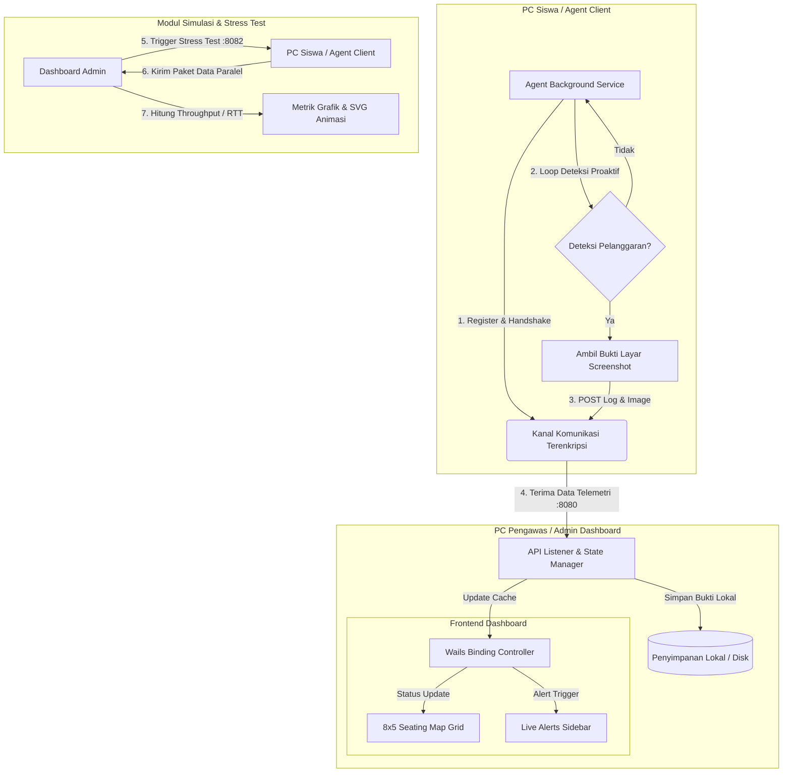

# 🛡️ ReksaFel — Anti-Cheating & Proctored Exam Monitoring System

**ReksaFel** is a high-performance proctored monitoring platform designed to maintain academic integrity in local computer laboratory examinations. Built with a decentralized architecture, it enables proctors to oversee up to 40 client workstations concurrently over a secure, encrypted peer-to-peer network mesh.

**ReksaFel** adalah platform pengawas ujian lokal yang dirancang untuk menjaga kejujuran akademik di lab komputer. Melalui jaringan tertutup (*peer-to-peer mesh*) terenkripsi, pengawas dapat memantau aktivitas, mendeteksi kecurangan, dan mengumpulkan bukti tangkapan layar dari 40 komputer siswa secara real-time dari satu dashboard utama.

This repository serves as the public documentation, core API specification, and technical preview hub for the ReksaFel system.

---

## 🌌 Key Concepts & Architecture

ReksaFel is optimized for server-less local networks, converting standard lab environments into secure, controlled testing zones.

```text
  +-------------------------------+                 +-----------------------------------+
  |   Student Client (Agent)      |                 |    Proctor Dashboard (Admin)      |
  |   - Silent telemetry service  |                 |    - Go-based API Controller      |
  |   - Screen monitoring agent   |                 |    - Wails OS Desktop Wrapper     |
  +---------------+---------------+                 +-----------------+-----------------+
                  |                                                   |
                  |     Encrypted Telemetry Logs & Screenshots        |
                  +-------------------------------------------------->| [HTTP API :8080]
                  |     (Real-time cheat alerts, process state)       |
                  |                                                   |
                  |     AES-256-GCM Key Verification & Rotation      |
                  |<--------------------------------------------------+ [Push Service :8081]
                  |                                                   |
                  |     Controlled Network Stress Commands            |
                  |<--------------------------------------------------+ [Load Simulator :8082]
```

### 1. Zero-Trust Network Mesh
All communications occur via a secure peer-to-peer overlay network. Only authenticated client nodes using dynamically rotated verification keys can communicate with the dashboard, preventing external spoofing.

### 2. Live Seating Grid Map (8x5)
A dynamic layout mirroring the physical laboratory seating arrangement. Proctors can instantly view client states:
* ⚪ **Offline**: Agent inactive.
* 🟢 **Online (Secure)**: Agent active and running in a safe exam state.
* 🟡 **Alert (Active)**: Live violation in progress.
* 🔴 **Violated (Previous)**: Node registered a rule violation earlier in the session.

### 3. Proactive Evidence Logging
Upon detecting prohibited online activities or banned processes, the client agent automatically captures screen evidence. Screenshots are securely sent, decrypted, and archived locally on the Admin station with no cloud dependencies.

### 4. Network Stress Simulator
A built-in stress tester that validates the dashboard's I/O throughput. Proctors can trigger simulated concurrent data payloads from clients to verify network capacity and UI responsiveness under heavy load.

---

## 🎓 Tinjauan Akademis & Alur Sistem (System Flow)

ReksaFel mengadopsi model **Hybrid Centralized-Mesh** untuk pengawasan terisolasi:
* **Non-Intrusive Agent:** Agen berjalan sebagai *background service* ringan di PC siswa tanpa membebani performa sistem.
* **Asynchronous Concurrency:** Backend Go menggunakan *Goroutines* untuk memproses unggahan bukti tangkapan layar secara paralel tanpa menghambat antrean input/output (I/O).

### Diagram Alur Sistem (System Flowchart)



---

## 💻 Development & Public Specifications

This repository contains the open-source API specifications, telemetry schemas, and local encryption concepts representing the ReksaFel system:

* **`pkg/telemetry/`** — Data structures and serialization schemas defining client screen capture payloads and event logs.
* **`pkg/net/`** — Concurrent TCP network latency probing routines utilizing Goroutines and Context timeouts.
* **`pkg/api/`** — Standard API router specifications and authorization middleware representations.
* **`pkg/config/`** — Conceptual local configuration sealer demonstrating safe GCM initialization vector generation and key management.

> [!NOTE]
> To comply with security policies and target deployment guidelines, the central orchestrator control plane, mesh networking routers, and backend credentials are not included in this public specification layout.

---

## 🛠️ Technology Stack

* **Backend Engine:** Go (Golang) — High-concurrency network routines and Windows binary compilation.
* **Frontend Shell:** Vanilla JS, CSS3, & HTML5 — Compiled into a native application via **Wails v2**.
* **Security Layer:** AES-256-GCM encryption for configuration sealing using native Windows machine identifiers.

---

## 📋 Repository Contents

* [reksafel_feature_status.md](reksafel_feature_status.md) — Detailed feature checklist, backend system mechanisms, and version log tracking (`v1.0.0` to `v1.3.0`).

---

## 💡 Curiosity & Contact

For inquiries regarding architectural reviews, commercial integration of the Zero-Trust mesh network layer, or technical collaboration, feel free to open an issue or reach out directly!
