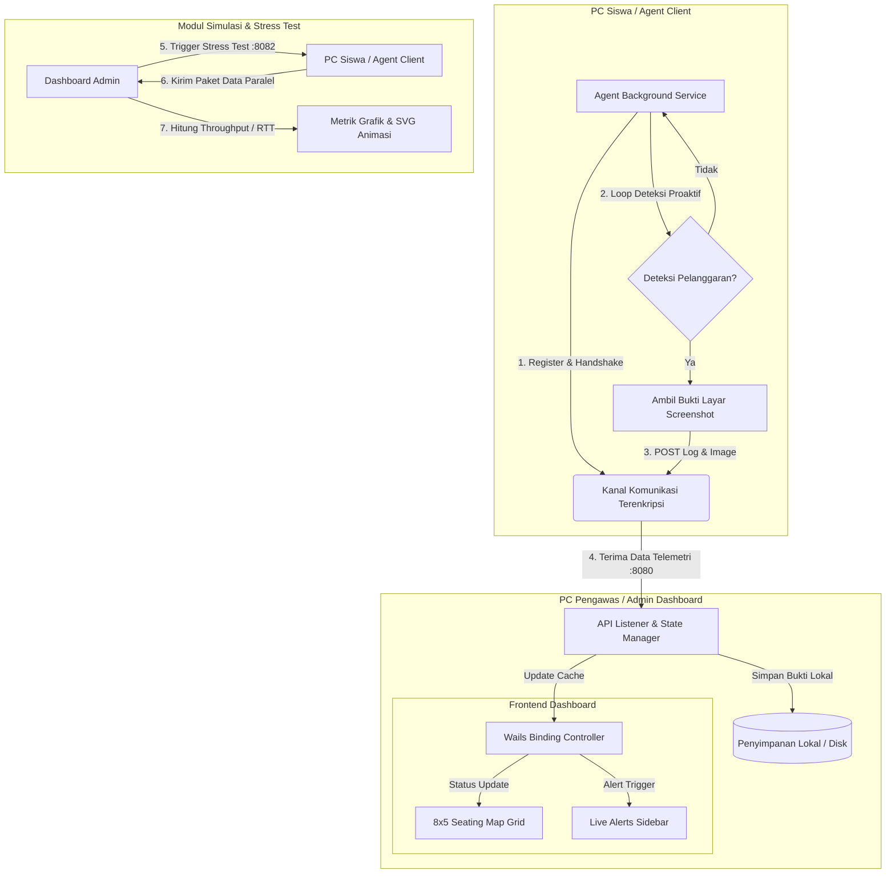

# 🛡️ ReksaFel — Anti-Cheating & Proctored Exam Monitoring System

**ReksaFel** is a high-performance proctored monitoring platform designed to maintain academic integrity in local computer laboratory examinations. Built with a decentralized architecture, it enables proctors to oversee up to 40 client workstations concurrently over a secure, encrypted peer-to-peer network mesh.

**ReksaFel** adalah platform pengawas ujian lokal yang dirancang untuk menjaga kejujuran akademik di lab komputer. Melalui jaringan tertutup (*peer-to-peer mesh*) terenkripsi, pengawas dapat memantau aktivitas, mendeteksi kecurangan, dan mengumpulkan bukti tangkapan layar dari 40 komputer siswa secara real-time dari satu dashboard utama.

This repository serves as the public documentation, core API specification, and technical preview hub for the ReksaFel system.

---

## 🌌 Key Concepts & Architecture

ReksaFel is optimized for server-less local networks, converting standard lab environments into secure, controlled testing zones.

```text
  +-------------------------------+                 +-----------------------------------+
  |   Student Client (Agent)      |                 |    Proctor Dashboard (Admin)      |
  |   - Silent telemetry service  |                 |    - Go-based API Controller      |
  |   - Screen monitoring agent   |                 |    - Wails OS Desktop Wrapper     |
  +---------------+---------------+                 +-----------------+-----------------+
                  |                                                   |
                  |     Encrypted Telemetry Logs & Screenshots        |
                  +-------------------------------------------------->| [HTTP API :8080]
                  |     (Real-time cheat alerts, process state)       |
                  |                                                   |
                  |     AES-256-GCM Key Verification & Rotation      |
                  |<--------------------------------------------------+ [Push Service :8081]
                  |                                                   |
                  |     Controlled Network Stress Commands            |
                  |<--------------------------------------------------+ [Load Simulator :8082]
```

### 1. Zero-Trust Network Mesh
All communications occur via a secure peer-to-peer overlay network. Only authenticated client nodes using dynamically rotated verification keys can communicate with the dashboard, preventing external spoofing.

### 2. Live Seating Grid Map (8x5)
A dynamic layout mirroring the physical laboratory seating arrangement. Proctors can instantly view client states:
* ⚪ **Offline**: Agent inactive.
* 🟢 **Online (Secure)**: Agent active and running in a safe exam state.
* 🟡 **Alert (Active)**: Live violation in progress.
* 🔴 **Violated (Previous)**: Node registered a rule violation earlier in the session.

### 3. Proactive Evidence Logging
Upon detecting prohibited online activities or banned processes, the client agent automatically captures screen evidence. Screenshots are securely sent, decrypted, and archived locally on the Admin station with no cloud dependencies.

### 4. Network Stress Simulator
A built-in stress tester that validates the dashboard's I/O throughput. Proctors can trigger simulated concurrent data payloads from clients to verify network capacity and UI responsiveness under heavy load.

---

## 🎓 Tinjauan Akademis & Alur Sistem (System Flow)

ReksaFel mengadopsi model **Hybrid Centralized-Mesh** untuk pengawasan terisolasi:
* **Non-Intrusive Agent:** Agen berjalan sebagai *background service* ringan di PC siswa tanpa membebani performa sistem.
* **Asynchronous Concurrency:** Backend Go menggunakan *Goroutines* untuk memproses unggahan bukti tangkapan layar secara paralel tanpa menghambat antrean input/output (I/O).

### Diagram Alur Sistem (System Flowchart)



---

## 💻 Development & Public Specifications

This repository contains the open-source API specifications, telemetry schemas, and local encryption concepts representing the ReksaFel system:

* **`pkg/telemetry/`** — Data structures and serialization schemas defining client screen capture payloads and event logs.
* **`pkg/net/`** — Concurrent TCP network latency probing routines utilizing Goroutines and Context timeouts.
* **`pkg/api/`** — Standard API router specifications and authorization middleware representations.
* **`pkg/config/`** — Conceptual local configuration sealer demonstrating safe GCM initialization vector generation and key management.

> [!NOTE]
> To comply with security policies and target deployment guidelines, the central orchestrator control plane, mesh networking routers, and backend credentials are not included in this public specification layout.

---

## 🛠️ Technology Stack

* **Backend Engine:** Go (Golang) — High-concurrency network routines and Windows binary compilation.
* **Frontend Shell:** Vanilla JS, CSS3, & HTML5 — Compiled into a native application via **Wails v2**.
* **Security Layer:** AES-256-GCM encryption for configuration sealing using native Windows machine identifiers.

---

## 📋 Repository Status & Development Logs

Berikut adalah rincian lengkap mengenai peta navigasi, tata letak antarmuka, mekanisme sistem di belakang layar, dan histori log pembaruan fitur dashboard **ReksaFel**:

<details>
<summary><b>🛠️ Klik untuk Membuka Papan Status Fitur & Log Pengembangan (Click to Expand)</b></summary>
<br>

# 🛡️ Papan Status Fitur & Pengembangan ReksaFel

Pusat kendali dan pelacakan status pengembangan fitur **Dashboard Admin ReksaFel**. Halaman ini dirancang menggunakan standar Markdown agar dapat langsung dirender secara visual dan interaktif baik secara lokal di **IDE (VS Code)** maupun di **GitHub**.

---

## 1. Peta Navigasi & Struktur Tab (Tampilan Visual IDE)

Bagan berikut dapat langsung dilihat secara visual di dalam editor teks/IDE biasa tanpa perlu dirender:

```text
                  +-------------------------------------------------+
                  |      🖥️ DASHBOARD UTAMA ADMIN (ReksaFel)        |
                  +-------------------------------------------------+
                                           |
         +--------------------+------------+------------+--------------------+
         |                    |                         |                    |
         v                    v                         v                    v
 +---------------+    +---------------+         +---------------+    +---------------+
 |  1. MONITOR   |    | 2. LOG AKTIV. |         | 3. RESOURCE T.|    |  4. SETTINGS  |
 +---------------+    +---------------+         +---------------+    +---------------+
         |                    |                         |                    |
         +--> Seat Grid       +--> Log Table            +--> Load Config     +--> Key Mgmt
         +--> Live Alerts     +--> Accordion Details    +--> Net Metrics     +--> System Info
         +--> Metrics Cards   +--> Lightbox Gallery     +--> CPU/RAM/TCP
                              +--> Export ZIP
```

---

## 2. Peta Layout Modul Dashboard (Tampilan Grid Visual IDE)

Bagan berikut memetakan status kesehatan dan frekuensi pembaruan sub-fitur di bawah masing-masing Tab secara visual langsung di editor teks:

```text
+---------------------------+---------------------------+---------------------------+---------------------------+
| 1. TAB MONITOR            | 2. TAB LOG AKTIVITAS      | 3. TAB RESOURCE TESTING   | 4. TAB SETTINGS           |
+---------------------------+---------------------------+---------------------------+---------------------------+
| [Seating Map Grid]        | [Tabel Log Utama]         | [Konfigurasi Beban]       | [Auth Key Management]     |
| Status : STABIL [OK]      | Status : STABIL [OK]      | Status : STABIL [OK]      | Status : STABIL [OK]      |
| Update : 2x               | Update : 3x               | Update : 2x               | Update : 1x               |
+---------------------------+---------------------------+---------------------------+---------------------------+
| [Live Alerts Sidebar]     | [Accordion Detail Log]    | [Metrik Trafik Jaringan]  | [System Information]      |
| Status : STABIL [OK]      | Status : STABIL [OK]      | Status : STABIL [OK]      | Status : STABIL [OK]      |
| Update : 3x               | Update : 2x               | Update : 4x               | Update : 1x               |
+---------------------------+---------------------------+---------------------------+---------------------------+
| [Cards Ringkasan]         | [Galeri Bukti]            | [Monitor Resource PC]     |                           |
| Status : STABIL [OK]      | Status : STABIL [OK]      | Status : STABIL [OK]      |                           |
| Update : 1x               | Update : 2x               | Update : 2x               |                           |
+---------------------------+---------------------------+---------------------------+---------------------------+
|                           | [Ekspor Laporan (ZIP)]    |                           |                           |
|                           | Status : STABIL [OK]      |                           |                           |
|                           | Update : 2x               |                           |                           |
+---------------------------+---------------------------+---------------------------+---------------------------+
```

---

## 3. Rincian Fitur & Alur Kerja Di Belakang Layar

> [!TIP]
> Klik pada baris status di masing-masing sub-fitur di bawah ini untuk melihat deskripsi fungsi, mekanisme sistem di belakang layar, dan histori log perubahan.

### Seating Map Grid (8x5)
<details>
<summary>🟢 <b>Status: Stabil</b> — [🔄 2 Update] — <i>Klik untuk detail</i></summary>
<br>

*   **Deskripsi Fungsional:**
    Menampilkan visual tata letak ruang lab komputer (grid 8 baris × 5 kolom = 40 meja). Setiap sel meja secara dinamis mewakili status PC Siswa saat ini dengan indikasi warna visual: Abu-abu (Offline), Hijau (Online Aman), Kuning Berkedip (Melanggar/Alert aktif), dan Merah (Telah melanggar sebelumnya).
*   **Mekanisme Di Belakang Layar (Sistem):**
    *   Sistem frontend merender grid statis berisi 40 kursi saat inisialisasi.
    *   Fungsi `GetClientsStatus()` dijalankan setiap beberapa detik untuk mengambil peta status dari RAM Admin.
    *   Data klien yang online dipetakan berdasarkan properti `c.Seat` untuk mewarnai sel kursi bersangkutan.
*   **Histori Log Perubahan:**
    *   `v1.1.0` (2026-05-25): Optimalisasi sinkronisasi data seat klien agar nomor kursi dipetakan secara dinamis berdasarkan respons IP dan nama host terdaftar.
    *   `v1.0.0` (2026-05-15): Pembuatan awal tata letak layout grid 8x5 beserta visual styling warna status.
</details>

### Live Alerts Sidebar
<details>
<summary>🟢 <b>Status: Stabil</b> — [🔄 3 Update] — <i>Klik untuk detail</i></summary>
<br>

*   **Deskripsi Fungsional:**
    Sidebar kanan yang menampilkan alarm peringatan instan mengenai pelanggaran aktif yang saat ini terjadi (misalnya siswa sedang membuka situs AI ChatGPT). Menyertakan thumbnail tangkapan layar melayang saat di-hover.
*   **Mekanisme Di Belakang Layar (Sistem):**
    *   Fungsi `renderAlerts()` memproses array log terbalik (logs terbaru di atas).
    *   Menggunakan filter dedup: logs dipindai dan hanya merekam alert pertama/terbaru per meja siswa.
    *   Informasi log lama untuk meja bersangkutan secara otomatis diabaikan agar sidebar tidak penuh.
*   **Histori Log Perubahan:**
    *   `v1.1.2` (2026-06-12): Perbaikan layout text wrapping: nama siswa atau teks log yang sangat panjang tidak memicu elemen HTML melebar secara horizontal.
    *   `v1.1.1` (2026-06-08): Perbaikan logika overwriting: memastikan logs terbaru tidak tertutup oleh status log GAP atau log usang.
    *   `v1.0.0` (2026-05-15): Implementasi awal panel deteksi pelanggaran real-time di sisi samping dashboard.
</details>

### Cards Ringkasan Metrik
<details>
<summary>🟢 <b>Status: Stabil</b> — [🔄 1 Update] — <i>Klik untuk detail</i></summary>
<br>

*   **Deskripsi Fungsional:**
    Empat kartu metrik di bagian atas halaman Monitor untuk memberikan ringkasan status lab secara agregat: Total Registered, Active (Online), Active Alerts, dan VPN Tunnel Status.
*   **Mekanisme Di Belakang Layar (Sistem):**
    *   `Total Registered`: Menghitung ukuran objek `c.clients` di memori Admin.
    *   `Active`: Menghitung klien yang memiliki flag `c.online = true`.
    *   `Active Alerts`: Menghitung klien yang memiliki flag `c.alert = true`.
    *   `VPN Tunnel Status`: Melakukan ping internal ke gateway mesh 100.x.x.x untuk memastikan koneksi VPN stabil.
*   **Histori Log Perubahan:**
    *   `v1.0.0` (2026-05-15): Inisialisasi kartu metrik ringkasan performa terintegrasi dengan Wails binding.
</details>

---

### Tabel Log Utama
<details>
<summary>🟢 <b>Status: Stabil</b> — [🔄 3 Update] — <i>Klik untuk detail</i></summary>
<br>

*   **Deskripsi Fungsional:**
    Tabel sentral di halaman Log Aktivitas yang mencatat histori seluruh peristiwa penting ujian (Siswa Login, GAP dimulai/diakhiri, Percobaan akses AI, dan Pemulihan status).
*   **Mekanisme Di Belakang Layar (Sistem):**
    *   Menggunakan layout tabel tetap (`table-layout: fixed`) dan pemotongan kata (`word-wrap: break-word`) untuk stabilitas lebar kolom.
    *   Membaca array log dari backend Admin (`a.logs`) secara dinamis.
*   **Histori Log Perubahan:**
    *   `v1.1.2` (2026-06-12): Mengatasi bug geser kolom: Teks URL panjang kini dipaksa turun ke baris baru, memastikan tombol Bukti Layar tidak tergeser keluar dari layar.
    *   `v1.1.0` (2026-05-25): Integrasi kolom nama yang divalidasi maksimal 5 kata dari sisi klien.
    *   `v1.0.0` (2026-05-15): Struktur awal tabel log aktivitas pengawasan.
</details>

### Accordion Detail Log
<details>
<summary>🟢 <b>Status: Stabil</b> — [🔄 2 Update] — <i>Klik untuk detail</i></summary>
<br>

*   **Deskripsi Fungsional:**
    Menu lipat (accordion) pada setiap baris log utama. Ketika baris siswa diklik, menu akan bergeser membuka ke bawah untuk menampilkan riwayat log rinci khusus untuk siswa tersebut.
*   **Mekanisme Di Belakang Layar (Sistem):**
    *   Tabel log detail di dalam baris accordion diurutkan secara terbalik (*newest-first*) sehingga tindakan mencurigakan terbaru langsung terlihat paling atas.
    *   Tabel dibungkus di dalam elemen kontainer dengan pembatas tinggi (`max-height: 250px`) dan scrollbar vertikal otomatis.
*   **Histori Log Perubahan:**
    *   `v1.1.2` (2026-06-12): Optimalisasi urutan logs menjadi terbaru-di-atas (*newest-first*) dan penambahan scrollable container agar accordion tidak memperpanjang tinggi halaman secara berlebih.
    *   `v1.0.0` (2026-05-15): Pembuatan awal accordion detail untuk pemantauan terisolasi per siswa.
</details>

### Galeri Bukti (Lightbox)
<details>
<summary>🟢 <b>Status: Stabil</b> — [🔄 2 Update] — <i>Klik untuk detail</i></summary>
<br>

*   **Deskripsi Fungsional:**
    Tampilan pop-up galeri gambar (Lightbox) berukuran penuh saat pengawas mengeklik bukti tangkapan layar. Menyertakan navigasi Prev/Next dan tombol unduh langsung.
*   **Mekanisme Di Belakang Layar (Sistem):**
    *   Gambar didekodekan dari paket Base64 dan disimpan di harddisk lokal Admin (`web/static/screenshots/`).
    *   Dashboard memanggil gambar menggunakan Wails custom asset handler via path `/static/screenshots/nama_file.jpg`.
*   **Histori Log Perubahan:**
    *   `v1.1.2` (2026-06-12): Pemuatan ulang galeri lokal berbasis statis JPG, menghilangkan bug gambar kosong/rusak akibat pemuatan Base64 mentah.
    *   `v1.0.0` (2026-05-15): Inisialisasi modal peninjau bukti screenshot dengan navigasi keyboard.
</details>

### Ekspor Laporan (ZIP)
<details>
<summary>🟢 <b>Status: Stabil</b> — [🔄 2 Update] — <i>Klik untuk detail</i></summary>
<br>

*   **Deskripsi Fungsional:**
    Tombol untuk mengekspor semua data aktivitas ujian. Menghasilkan satu file arsip ZIP berisi log tertulis (.txt) dan folder berisi seluruh screenshot bukti kecurangan yang berhasil dijepret.
*   **Mekanisme Di Belakang Layar (Sistem):**
    *   Menggabungkan seluruh histori logs dari memori RAM ke dalam sebuah file teks log ujian.
    *   Membaca file-file screenshot dari direktori screenshots lokal.
    *   Menggunakan pustaka arsip Go (`archive/zip`) untuk mengepak keduanya menjadi satu file ZIP tunggal.
*   **Histori Log Perubahan:**
    *   `v1.1.1` (2026-06-08): Penyederhanaan format ekspor menjadi file tunggal ZIP berisi log txt + folder screenshot, tanpa format terpisah CSV.
    *   `v1.0.0` (2026-05-15): Pembuatan awal modul pengepakan arsip data kelulusan ujian.
</details>

---

### Konfigurasi Beban (Load Test)
<details>
<summary>🟢 <b>Status: Stabil</b> — [🔄 2 Update] — <i>Klik untuk detail</i></summary>
<br>

*   **Deskripsi Fungsional:**
    Panel kontrol simulasi pengujian stres jaringan. Pengawas dapat menentukan jumlah paket request tiruan yang akan dikirim (1-100), jeda waktu (10-5000ms), dan pilihan menyertakan gambar dummy.
*   **Mekanisme Di Belakang Layar (Sistem):**
    *   Sistem menembakkan sinyal paralel ke port 8082 PC Klien menggunakan goroutine.
    *   Di sisi klien, dilakukan pengecekan IP whitelist Admin sebelum simulasi dipicu.
    *   Klien membatasi secara ketat parameter input (keamanan internal PC Klien).
*   **Histori Log Perubahan:**
    *   `v1.1.0` (2026-05-25): Implementasi IP Whitelisting keamanan port 8082 dan pembatasan rentang delay/request di sisi klien.
    *   `v1.0.0` (2026-05-20): Pembuatan awal form input konfigurasi uji stres.
</details>

### Metrik Trafik Jaringan
<details>
<summary>🟢 <b>Status: Stabil</b> — [🔄 3 Update] — <i>Klik untuk detail</i></summary>
<br>

*   **Deskripsi Fungsional:**
    Statistik real-time lalu lintas jaringan saat uji stres berlangsung. Menyajikan total paket terkirim, paket sukses/gagal, rata-rata waktu respons (ms), total throughput data (MB), serta panel visualisasi animasi aliran data antara PC Admin dan PC Klien.
*   **Mekanisme Di Belakang Layar (Sistem):**
    *   Menghitung waktu penerimaan paket secara mikrodetik di server (`/api/test-load-receiver`).
    *   Menggunakan nama berkas temporary unik (`temp_load_test_<id>_<num>.jpg`) saat menulis ke disk.
    *   Berkas langsung dihapus setelah ditulis untuk menyimulasikan I/O disk rill bebas konflik.
    *   Melacak siklus pengujian beban (load test) secara dinamis menggunakan JS state machine (`setAnimationState()`).
    *   Menggambar kurva bezier SVG indah penghubung PC Admin dan Klien secara real-time (`updateVizLines()`) pada tab-switch & window resize.
    *   Memicu animasi aliran paket data pulang-pergi terurut: Paket Request (Biru) meluncur dari Admin ke Klien, disusul jeda singkat, kemudian Paket Response (Hijau) kembali dari Klien ke Admin menggunakan elemen `<animateMotion>` SVG dengan pengikatan peristiwa SMIL (`begin="..."`).
*   **Histori Log Perubahan:**
    *   `v1.3.0` (2026-06-13): **[UI RESTRUCTURE & SEQUENTIAL FLOW]**
        *   Restrukturasi layout visualisasi menjadi Side-by-Side Flex Layout (Visualisasi real-time interaktif di sebelah kiri, Form Pengaturan & Metrik Live dalam satu Sidebar ringkas di sebelah kanan).
        *   Implementasi alur pengiriman paket berurutan (Package Request Biru terkirim lebih dahulu dari Admin ke Klien, diikuti Package Response Hijau yang meluncur balik dari Klien ke Admin setelah jeda).
        *   Penghapusan API Path info string (`POST /api/...`) dari panel visualisasi agar tampilan lebih bersih dan modern.
    *   `v1.2.0` (2026-06-12): **[NEW VISUALIZATION]** Penambahan panel visualisasi real-time berbasis animasi aliran data SVG/CSS (Pengiriman -> Pemrosesan -> Respon Diterima) yang menghubungkan PC Admin dengan Client Meja 05, Meja 12, dan Meja 28.
    *   `v1.1.2` (2026-06-12): **[MAJOR FIX]** Menghilangkan error *sharing violation* pada Windows dengan menggunakan nama file unik per request klien.
    *   `v1.0.0` (2026-05-20): Inisialisasi panel pencatat performa throughput data jaringan.
</details>

### Monitoring Resource PC Admin
<details>
<summary>🟢 <b>Status: Stabil</b> — [🔄 2 Update] — <i>Klik untuk detail</i></summary>
<br>

*   **Deskripsi Fungsional:**
    Indikator performa perangkat keras PC Admin secara real-time yang mencakup: persentase beban CPU, penggunaan memori RAM oleh aplikasi Go, dan jumlah soket koneksi TCP aktif di port 8080.
*   **Mekanisme Di Belakang Layar (Sistem):**
    *   CPU: Dieksekusi secara berkala menggunakan perintah `wmic cpu get LoadPercentage` dengan fallback cmdlet powershell.
    *   RAM: Membaca alokasi memori heap internal Go lewat `runtime.ReadMemStats()`.
    *   TCP Socket: Dihitung dengan mengeksekusi shell `cmd /c netstat -ano | findstr :8080 | find /c /v ""`.
*   **Histori Log Perubahan:**
    *   `v1.1.1` (2026-06-08): Penambahan fallback PowerShell untuk pembacaan persentase CPU jika wmic dibatasi sistem.
    *   `v1.0.0` (2026-05-20): Pembuatan modul penarik informasi utilisasi hardware lokal.
</details>

---

### Auth Key Management
<details>
<summary>🟢 <b>Status: Stabil</b> — [🔄 1 Update] — <i>Klik untuk detail</i></summary>
<br>

*   **Deskripsi Fungsional:**
    Manajemen kunci otentikasi ReksaFel Zero-Trust. Pengawas dapat menginput kunci baru, memantau tanggal pembaruan, menghitung sisa hari aktif kunci, dan mengirimkannya ke semua klien secara nirkabel.
*   **Mekanisme Di Belakang Layar (Sistem):**
    *   Mendekripsi kunci `config.json` lokal menggunakan AES-256-GCM berbasis kunci Windows `MachineGuid`.
    *   Tombol PUSH mengirimkan kunci baru secara aman ke port 8081 masing-masing PC klien aktif.
*   **Histori Log Perubahan:**
    *   `v1.0.0` (2026-05-15): Inisialisasi sistem manajemen enkripsi key rotation dan push nirkabel.
</details>

### System Information
<details>
<summary>🟢 <b>Status: Stabil</b> — [🔄 1 Update] — <i>Klik untuk detail</i></summary>
<br>

*   **Deskripsi Fungsional:**
    Informasi sistem statis mengenai lokasi berkas konfigurasi lokal (`C:\ProgramData\ZeroGap\config.json`) dan port listener utama (8080).
*   **Mekanisme Di Belakang Layar (Sistem):**
    *   Menampilkan informasi konfigurasi aplikasi untuk panduan instalasi sistem.
*   **Histori Log Perubahan:**
    *   `v1.0.0` (2026-05-15): Pembuatan halaman rincian parameter server.
</details>

</details>

---

## 💡 Curiosity & Contact

For inquiries regarding architectural reviews, commercial integration of the Zero-Trust mesh network layer, or technical collaboration, feel free to open an issue or reach out directly!
