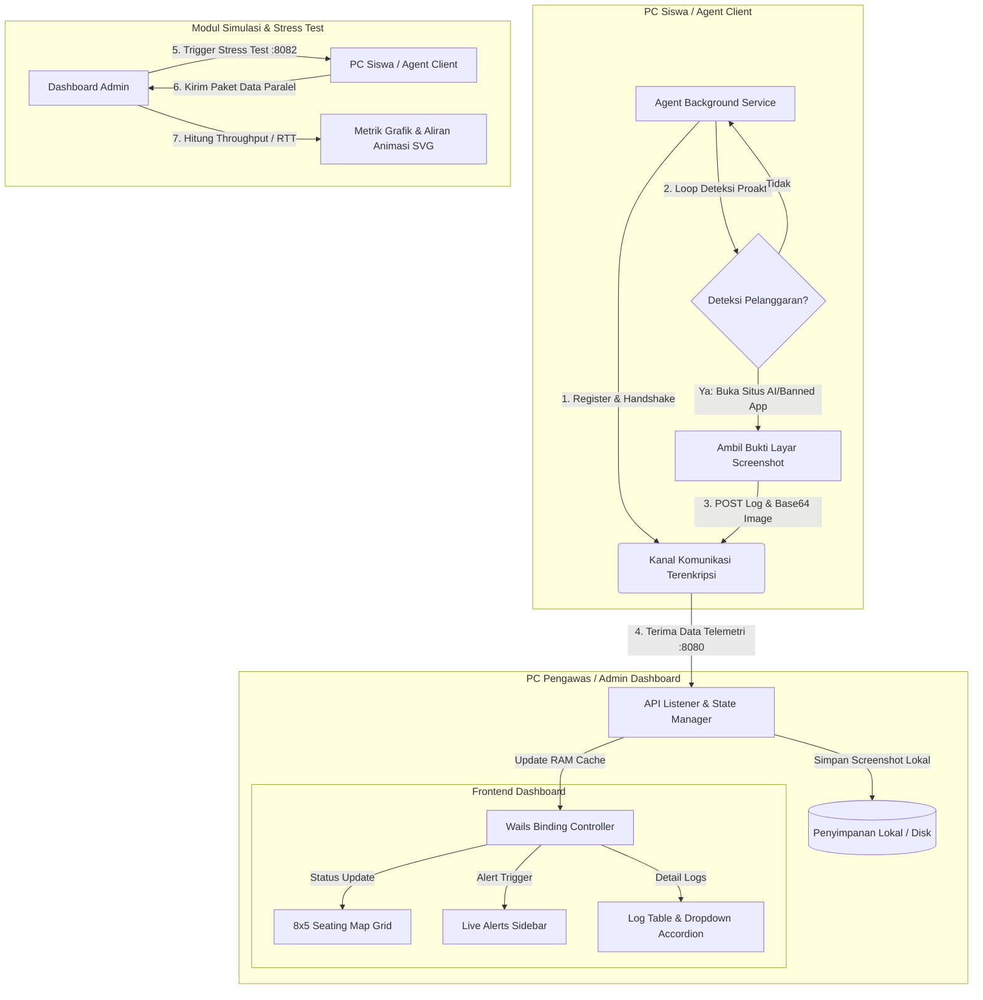

# 🛡️ ReksaFel — Anti-Cheating & Proctored Exam Monitoring System

ReksaFel is a secure, high-performance monitoring platform designed to manage and maintain academic integrity during local computer lab examinations. Built with a decentralized architecture, it allows exam proctors to oversee up to 40 student clients concurrently over a secure, encrypted peer-to-peer network mesh.

**ReksaFel** adalah platform pengawas (*monitoring*) ujian yang dirancang untuk menjaga kejujuran akademik di laboratorium komputer sekolah atau kampus. Dengan sistem jaringan tertutup (*peer-to-peer mesh*) yang aman dan terenkripsi, pengawas ujian bisa memantau hingga 40 komputer siswa sekaligus secara real-time dari satu dashboard utama. 

Aplikasi ini bekerja secara pasif di latar belakang komputer siswa untuk mendeteksi tindakan curang (seperti membuka ChatGPT, mesin pencari terlarang, atau aplikasi terlarang lainnya) dan langsung mengirimkan bukti tangkapan layar (*screenshot*) ke komputer pengawas tanpa membebani performa komputer siswa.

This repository serves as the public documentation, feature specification, and release tracking hub for the ReksaFel system.

---

## 🌌 Key Concepts & Architecture

ReksaFel is designed for secure, server-less local network environments, transforming standard computer labs into controlled examination zones.

```text
  +-------------------------------+                 +-----------------------------------+
  |   Student Client (Agent)      |                 |    Proctor Dashboard (Admin)      |
  |   - Silent telemetry service  |                 |    - Go-based API Controller      |
  |   - Screen monitoring agent   |                 |    - Wails OS Desktop Wrapper     |
  +---------------+---------------+                 +-----------------+-----------------+
                  |                                                   |
                  |     Encrypted Telemetry Logs & Screenshots        |
                  +-------------------------------------------------->| [HTTP API :8080]
                  |     (Real-time cheat alerts, process state)       |
                  |                                                   |
                  |     AES-256-GCM Key Verification & Rotation      |
                  |<--------------------------------------------------+ [Push Service :8081]
                  |                                                   |
                  |     Controlled Network Stress Commands            |
                  |<--------------------------------------------------+ [Load Simulator :8082]
```

### 1. ReksaFel Zero-Trust Network Mesh
All communication between student clients and the proctor's dashboard occurs via a dedicated, cryptographically secure peer-to-peer network overlay. Only authenticated client nodes with correct rotated keys can transmit telemetry data, preventing external spoofing or interception.

### 2. Live Seating Grid Map (8x5)
A dynamic layout mirroring the physical laboratory desk organization. Proctors can instantly spot the status of each station:
* ⚪ **Offline**: Client agent is inactive.
* 🟢 **Online (Secure)**: Client agent is running and in a safe exam state.
* 🟡 **Alert (Active)**: Visual flashing cue indicating a violation in progress.
* 🔴 **Violated (Previous)**: Indicator that the station has violated rules during the session.

### 3. Proactive Threat Detection & Evidence Log
When a student client attempts to access prohibited online resources (such as public AI services, unauthorized search engines) or run banned processes, the client agent immediately captures screen evidence.
* **Decentralized Storage:** Screenshots are securely transmitted, decoded, and stored locally on the Admin station, cataloged by time and seat number.
* **Instant Lightbox Gallery:** The proctor can click any alert thumbnail to inspect high-resolution evidence, complete with previous-next navigation.

### 4. Hardware Stress & Telemetry Simulation
A built-in stress simulator that verifies dashboard resilience and network bandwidth capacity. Proctors can trigger simultaneous, controlled data payloads from clients to test:
* **Disk I/O and Concurrency:** Simulates heavy write cycles on the Admin side without thread locks.
* **Live Network Flows:** Beautiful SVG Bezier curves connect the Admin to client nodes, animating real-time request-response sequences dynamically.

---

## 🎓 Tinjauan Akademis & Alur Sistem (Academic Overview & System Flow)

Secara akademis, ReksaFel dirancang untuk mengatasi keterbatasan pengawasan ujian konvensional berbasis manusia dan aplikasi *Lockdown Browser* konvensional yang sering kali memakan banyak *resource* sistem atau mudah ditembus melalui manipulasi jaringan lokal.

### 1. Pendekatan Desain Sistem
Platform ini mengadopsi model **Hybrid Centralized-Mesh**:
* **Zero-Trust Network Mesh:** Seluruh simpul komputer siswa (*Leaf Nodes*) terisolasi dalam satu segmen jaringan *overlay* khusus. Protokol enkripsi AES-256-GCM memastikan tidak ada paket manipulasi data yang disusupkan dari luar jaringan mesh.
* **Non-Intrusive Agent Polling:** Agen siswa bertindak sebagai layanan latar belakang (*background service*) pasif yang memonitor aktivitas API sistem operasi untuk mendeteksi pembukaan situs terlarang (seperti platform AI ChatGPT) tanpa mengganggu kinerja PC siswa.
* **Concurrent Asynchronous Serialization:** Backend Go menggunakan pola konkurensi berbasis *Goroutines* untuk memproses unggahan *Base64 screenshots* bukti kecurangan dari 40 klien secara paralel tanpa memblokir antrean I/O utama.

### 2. Diagram Alur Sistem (System Flowchart)

Berikut adalah visualisasi alur logika sistem pengawasan ReksaFel yang dapat langsung dirender secara interaktif di GitHub:



### 3. Skenario Penggunaan & Keandalan Infrastruktur
* **Laboratorium Komputer Terisolasi:** Sangat ideal untuk ruang lab berkapasitas besar (kapasitas 40 PC) di mana pengawas ujian memerlukan visualisasi *real-time* posisi tempat duduk fisik mahasiswa untuk pencocokan cepat.
* **Uji Toleransi Beban Jaringan (Network Stress Resilience):** Menggunakan stress simulator bawaan untuk menembakkan paket data tiruan dalam skala besar guna membuktikan bahwa aplikasi admin tidak akan mengalami *crash* atau *race condition* saat menangani banjir data telemetri secara serempak.

---

## 🛠️ Technology Stack

* **Backend Engine:** Go (Golang) — Leveraging Goroutines for high-concurrency network operations, low memory consumption, and compiled Windows binary speed.
* **Frontend Shell:** Vanilla JS, CSS3, & HTML5 — Compiled into a native, hardware-accelerated desktop application using the **Wails v2** framework.
* **Cryptographic Security:** AES-256-GCM encryption for local configs, utilizing native Windows machine identifiers (`MachineGuid`) for keystore sealing.
* **Data Transport:** Low-overhead JSON payloads via HTTP/REST endpoints.

---

## 📋 Repository Contents

* [reksafel_feature_status.md](reksafel_feature_status.md) — Detailed feature checklist, backend system mechanisms, and development logs mapping version upgrades (`v1.0.0` to `v1.3.0`).
* **`pkg/telemetry/`** — Data structures and serialization methods defining student screen capture payloads, event snapshots, and anomaly logging.
* **`pkg/net/`** — Core TCP network latency probing routines implementing asynchronous concurrency (Goroutines, Channels, and Context timeouts).
* **`pkg/api/`** — Standard router specifications and API authorization middleware representations.
* **`pkg/config/`** — Conceptual local configuration sealer utilizing secure AES-GCM encryption wrappers.

---

## 💻 Development & Public Specifications

This repository contains the open-source API specifications, client telemetry data schemas, network probing routines, and local configuration sealing concepts of the **ReksaFel** ecosystem. 

> [!NOTE]
> To comply with security policies and target deployment guidelines, the central orchestrator control plane, mesh networking routers, and backend credentials are not included in this public specification layout.

---

## 💡 Curiosity & Contact

This project is a showcase of building lightweight, secure, and highly visual desktop utilities that tie low-level system administration together with premium UX design. 

For inquiries regarding:
* Architectural source-code review
* Commercial licensing or implementation models
* Custom integrations of the ReksaFel Zero-Trust network layer

*Feel free to open an issue or reach out directly!*
