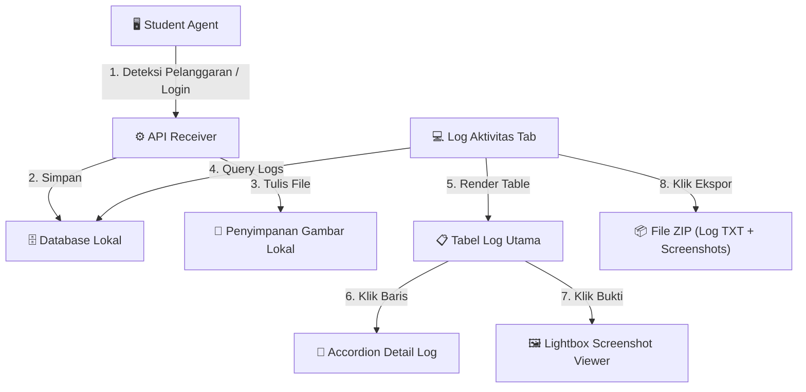
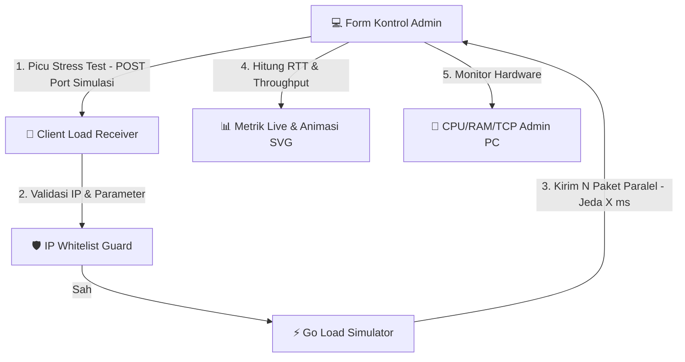
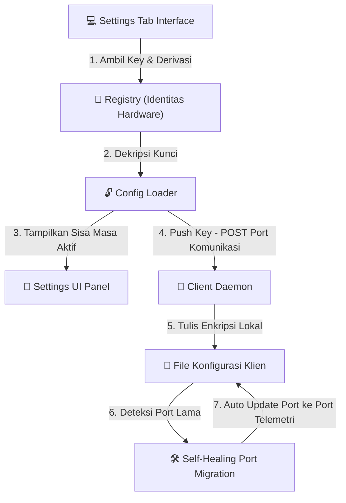

# 🛡️ Papan Status Fitur & Pengembangan ReksaFel

Pusat kendali dan pelacakan status pengembangan fitur **Dashboard Admin ReksaFel**. Halaman ini dirancang untuk memantau arsitektur fitur yang telah dikembangkan secara terstruktur, rapi, dan mudah diamati secara visual.

---

## 1. Peta Struktur Menu Utama & Modul (Visual Map)

Bagan berikut memetakan arsitektur navigasi tab utama dan sub-modul di dalam Dashboard Admin ReksaFel:

```text
                  +-------------------------------------------------+
                  |      🖥️ DASHBOARD UTAMA ADMIN (ReksaFel)        |
                  +-------------------------------------------------+
                                           |
         +--------------------+------------+------------+--------------------+
         |                    |                         |                    |
         v                    v                         v                    v
 +---------------+    +---------------+         +---------------+    +---------------+
 |  1. MONITOR   |    | 2. LOG AKTIV. |         | 3. RESOURCE T.|    |  4. SETTINGS  |
 +---------------+    +---------------+         +---------------+    +---------------+
         |                    |                         |                    |
         +--> Seat Grid       +--> Log Table            +--> Load Config     +--> Key Mgmt
         +--> Live Alerts     +--> Accordion Details    +--> Net Metrics     +--> System Info
         +--> Metrics Cards   +--> Lightbox Gallery     +--> CPU/RAM/TCP     +--> Client Daemon
                              +--> Export ZIP
```

---

## 2. Peta Tata Letak Modul & Status Kesehatan Fitur (Grid Visual)

Status kesehatan dan frekuensi pembaruan sub-fitur di bawah masing-masing Tab secara sekilas:

```text
+---------------------------+---------------------------+---------------------------+---------------------------+
| 1. TAB MONITOR            | 2. TAB LOG AKTIVITAS      | 3. TAB RESOURCE TESTING   | 4. TAB SETTINGS           |
+---------------------------+---------------------------+---------------------------+---------------------------+
| [Seating Map Grid]        | [Tabel Log Utama]         | [Konfigurasi Beban]       | [Auth Key Management]     |
| Status : STABIL [OK]      | Status : STABIL [OK]      | Status : STABIL [OK]      | Status : STABIL [OK]      |
| Update : 2x               | Update : 3x               | Update : 2x               | Update : 3x               |
+---------------------------+---------------------------+---------------------------+---------------------------+
| [Live Alerts Sidebar]     | [Accordion Detail Log]    | [Metrik Trafik Jaringan]  | [System Information]      |
| Status : STABIL [OK]      | Status : STABIL [OK]      | Status : STABIL [OK]      | Status : STABIL [OK]      |
| Update : 3x               | Update : 2x               | Update : 4x               | Update : 2x               |
+---------------------------+---------------------------+---------------------------+---------------------------+
| [Cards Ringkasan]         | [Galeri Bukti]            | [Monitor Resource PC]     | [Client Telemetry Daemon] |
| Status : STABIL [OK]      | Status : STABIL [OK]      | Status : STABIL [OK]      | Status : STABIL [OK]      |
| Update : 1x               | Update : 2x               | Update : 3x               | Update : 1x (Baru!)       |
+---------------------------+---------------------------+---------------------------+---------------------------+
|                           | [Ekspor Laporan (ZIP)]    |                           |                           |
|                           | Status : STABIL [OK]      |                           |                           |
|                           | Update : 2x               |                           |                           |
+---------------------------+---------------------------+---------------------------+---------------------------+
```

---

## 3. Tabel Ringkasan Pemantauan Status Fitur (Dashboard Update)

Tabel di bawah ini merangkum status seluruh komponen sistem yang telah didevelop untuk kebutuhan portofolio dan pemantauan cepat:

| Menu Utama / Tab | Nama Fitur & Modul | Status | Port / Protokol | Versi Terakhir | Pembaruan Utama Terkini |
| :--- | :--- | :--- | :--- | :--- | :--- |
| **1. MONITOR** | Seating Map Grid (8x5) | 🟢 STABIL | Dashboard UI | `v1.2.0` | Pemetaan tempat duduk dinamis, penanganan klien anonim (`—`) |
| | Live Alerts Sidebar | 🟢 STABIL | Dashboard UI | `v1.1.2` | Dukungan tipe `TASK_MANAGER` (lencana kuning), perbaikan text wrap |
| | Cards Ringkasan Metrik | 🟢 STABIL | Dashboard UI | `v1.0.0` | Penghitungan agregat total klien terdaftar, aktif, alert, & status VPN |
| **2. LOG AKTIVITAS**| Tabel Log Utama | 🟢 STABIL | Dashboard UI | `v1.1.2` | Pencegahan kolom tergeser oleh URL panjang, lencana `TASK_MANAGER` |
| | Accordion Detail Log | 🟢 STABIL | Dashboard UI | `v1.1.2` | Pengurutan log *newest-first* dan batas tinggi kontainer scrollable |
| | Galeri Bukti (Lightbox) | 🟢 STABIL | Custom Asset Handler | `v1.1.2` | Pemuatan berkas lokal statis JPG menghindari bug Base64 rusak |
| | Ekspor Laporan (ZIP) | 🟢 STABIL | Go Archive Zip | `v1.1.1` | Pengepakan satu file arsip ZIP berisi berkas teks log + folder screenshot |
| **3. RESOURCE TEST**| Konfigurasi Beban (Load Test) | 🟢 STABIL | Port Simulasi (TCP) | `v1.1.0` | Pembatasan rentang parameter masukan dan whitelisting IP Admin |
| | Metrik Trafik Jaringan | 🟢 STABIL | Port Telemetri (TCP) | `v1.4.0` | Animasi aliran paket SVG SMIL, visualisasi berurutan, & durasi minimum 5s |
| | Monitor Resource PC Admin | 🟢 STABIL | Port Telemetri (TCP) | `v1.2.0` | Migrasi port deteksi TCP socket ke port telemetri, fallback CPU |
| **4. SETTINGS** | Auth Key Management | 🟢 STABIL | Port Komunikasi (TCP) | `v1.2.0` | Dekripsi native registry Windows (Identitas Hardware), push nirkabel aman |
| | System Info & Port Migration| 🟢 STABIL | Port Telemetri (TCP) | `v1.2.0` | Migrasi port utama sistem dengan mekanisme self-healing kompatibilitas |
| | Client Telemetry Daemon | 🟢 STABIL | Klien Telemetri POST | `v1.2.1` | **[BARU]** Integrasi global startup hook untuk aktivasi otomatis di Task Scheduler |

---

## 4. Rincian Fitur & Alur Kerja Di Belakang Layar (Visual Track & Rincian Lengkap)

Bagian ini menyajikan visualisasi diagram alur kerja (*data track*) beserta deskripsi teknis lengkap untuk setiap fitur yang telah dikembangkan di Dashboard ReksaFel.

### 📂 TAB 1: MONITOR

#### Diagram Alur Data Fitur Monitor
```mermaid
flowchart LR
    Klien["🖥️ PC Klien (Meja 12)"] -->|1. Heartbeat/Alert - POST Port Telemetri| AdminAPI["⚙️ Admin HTTP Listener"]
    AdminAPI -->|2. Validasi & Update Cache| RAM["🧠 Admin RAM Memory"]
    RAM -->|3. GetClientsStatus()| Wails["🌐 Wails Binding"]
    Wails -->|4. Render UI| Grid["🎨 Seating Map Grid (8x5)"]
    Wails -->|5. Render Alerts| Sidebar["🔔 Live Alerts Sidebar"]
```

#### A. Seating Map Grid (8x5)
*   **Deskripsi Fungsional:**
    Menampilkan visual tata letak ruang lab komputer (grid 8 baris × 5 kolom = 40 meja). Setiap sel meja secara dinamis mewakili status PC Siswa saat ini dengan indikasi warna visual: Abu-abu (Offline), Hijau (Online Aman), Kuning Berkedip (Melanggar/Alert aktif), dan Merah (Telah melanggar sebelumnya).
*   **Mekanisme Di Belakang Layar (Sistem):**
    *   Sistem frontend merender grid statis berisi 40 kursi saat inisialisasi.
    *   Fungsi `GetClientsStatus()` dijalankan secara berkala untuk mengambil peta status dari RAM Admin.
    *   Data klien yang online dipetakan berdasarkan nomor tempat duduk terdaftar untuk mewarnai sel kursi bersangkutan.
*   **Histori Log Perubahan:**
    *   `v1.2.0` (2026-06-23): Integrasi anonimitas tempat duduk. Klien yang baru terhubung via heartbeat tanpa login nama siswa akan ditampilkan sebagai `—` (bukan hostname mentah) untuk menjaga kerapian visual.
    *   `v1.1.0` (2026-05-25): Optimalisasi sinkronisasi data seat klien agar nomor kursi dipetakan secara dinamis berdasarkan respons IP dan nama host terdaftar.
    *   `v1.0.0` (2026-05-15): Pembuatan awal tata letak layout grid 8x5 beserta visual styling warna status.

#### B. Live Alerts Sidebar
*   **Deskripsi Fungsional:**
    Sidebar kanan yang menampilkan alarm peringatan instan mengenai pelanggaran aktif yang saat ini terjadi (misalnya siswa sedang membuka situs AI ChatGPT). Menyertakan thumbnail tangkapan layar melayang saat di-hover.
*   **Mekanisme Di Belakang Layar (Sistem):**
    *   Fungsi `renderAlerts()` memproses array log terbalik (logs terbaru di atas).
    *   Menggunakan filter dedup: logs dipindai dan hanya merekam alert pertama/terbaru per meja siswa.
    *   Informasi log lama untuk meja bersangkutan secara otomatis diabaikan agar sidebar tidak penuh.
*   **Histori Log Perubahan:**
    *   `v1.1.2` (2026-06-23): Integrasi log tipe `TASK_MANAGER` dengan warna lencana kuning/amber khusus (bukan merah "CHEAT") untuk membedakan aktivitas sistem dengan kecurangan akademis visual.
    *   `v1.1.1` (2026-06-12): Perbaikan layout text wrapping: nama siswa atau teks log yang sangat panjang tidak memicu elemen HTML melebar secara horizontal.
    *   `v1.1.0` (2026-06-08): Perbaikan logika overwriting: memastikan logs terbaru tidak tertutup oleh status log GAP atau log usang.
    *   `v1.0.0` (2026-05-15): Implementasi awal panel deteksi pelanggaran real-time di sisi samping dashboard.

#### C. Cards Ringkasan Metrik
*   **Deskripsi Fungsional:**
    Empat kartu metrik di bagian atas halaman Monitor untuk memberikan ringkasan status lab secara agregat: Total Registered, Active (Online), Active Alerts, dan VPN Tunnel Status.
*   **Mekanisme Di Belakang Layar (Sistem):**
    *   `Total Registered`: Menghitung ukuran klien terdaftar di memori Admin.
    *   `Active`: Menghitung klien yang memiliki status online aktif.
    *   `Active Alerts`: Menghitung klien yang memiliki status alert aktif.
    *   `VPN Tunnel Status`: Melakukan ping internal ke gateway mesh terenkripsi untuk memastikan koneksi VPN stabil.
*   **Histori Log Perubahan:**
    *   `v1.0.0` (2026-05-15): Inisialisasi kartu metrik ringkasan performa terintegrasi dengan Wails binding.

---

### 📂 TAB 2: LOG AKTIVITAS

#### Diagram Alur Data Fitur Log Aktivitas


#### A. Tabel Log Utama
*   **Deskripsi Fungsional:**
    Tabel sentral di halaman Log Aktivitas yang mencatat histori seluruh peristiwa penting ujian (Siswa Login, GAP dimulai/diakhiri, Percobaan akses AI, dan Pemulihan status).
*   **Mekanisme Di Belakang Layar (Sistem):**
    *   Menggunakan layout tabel tetap (`table-layout: fixed`) dan pemotongan kata (`word-wrap: break-word`) untuk stabilitas lebar kolom.
    *   Membaca array log dari backend Admin secara dinamis.
*   **Histori Log Perubahan:**
    *   `v1.1.2` (2026-06-23): Integrasi filter dan rendering lencana amber khusus untuk log berjenis `TASK_MANAGER`.
    *   `v1.1.1` (2026-06-12): Mengatasi bug geser kolom: Teks URL panjang kini dipaksa turun ke baris baru, memastikan tombol Bukti Layar tidak tergeser keluar dari layar.
    *   `v1.1.0` (2026-05-25): Integrasi kolom nama yang divalidasi maksimal 5 kata dari sisi klien.
    *   `v1.0.0` (2026-05-15): Struktur awal tabel log aktivitas pengawasan.

#### B. Accordion Detail Log
*   **Deskripsi Fungsional:**
    Menu lipat (accordion) pada setiap baris log utama. Ketika baris siswa diklik, menu akan bergeser membuka ke bawah untuk menampilkan riwayat log rinci khusus untuk siswa tersebut.
*   **Mekanisme Di Belakang Layar (Sistem):**
    *   Tabel log detail di dalam baris accordion diurutkan secara terbalik (*newest-first*) sehingga tindakan mencurigakan terbaru langsung terlihat paling atas.
    *   Tabel dibungkus di dalam elemen kontainer dengan pembatas tinggi dan scrollbar vertikal otomatis.
*   **Histori Log Perubahan:**
    *   `v1.1.2` (2026-06-12): Optimalisasi urutan logs menjadi terbaru-di-atas (*newest-first*) dan penambahan scrollable container agar accordion tidak memperpanjang tinggi halaman secara berlebih.
    *   `v1.0.0` (2026-05-15): Pembuatan awal accordion detail untuk pemantauan terisolasi per siswa.

#### C. Galeri Bukti (Lightbox)
*   **Deskripsi Fungsional:**
    Tampilan pop-up galeri gambar (Lightbox) berukuran penuh saat pengawas mengeklik bukti tangkapan layar. Menyertakan navigasi Prev/Next dan tombol unduh langsung.
*   **Mekanisme Di Belakang Layar (Sistem):**
    *   Gambar didekodekan dari paket Base64 dan disimpan di media penyimpanan lokal Admin.
    *   Dashboard memanggil gambar menggunakan penangan aset kustom via jalur file lokal terenkripsi.
*   **Histori Log Perubahan:**
    *   `v1.1.2` (2026-06-12): Pemuatan ulang galeri lokal berbasis berkas gambar statis, menghilangkan bug gambar kosong/rusak akibat pemuatan Base64 mentah.
    *   `v1.0.0` (2026-05-15): Inisialisasi modal peninjau bukti screenshot dengan navigasi keyboard.

#### D. Ekspor Laporan (ZIP)
*   **Deskripsi Fungsional:**
    Tombol untuk mengekspor semua data aktivitas ujian. Menghasilkan satu file arsip ZIP berisi log tertulis (.txt) dan folder berisi seluruh screenshot bukti kecurangan yang berhasil dijepret.
*   **Mekanisme Di Belakang Layar (Sistem):**
    *   Menggabungkan seluruh histori logs dari memori RAM ke dalam sebuah file teks log ujian.
    *   Membaca file-file screenshot dari direktori screenshots lokal.
    *   Menggunakan pustaka arsip Go (`archive/zip`) untuk mengepak keduanya menjadi satu file ZIP tunggal.
*   **Histori Log Perubahan:**
    *   `v1.1.1` (2026-06-08): Penyederhanaan format ekspor menjadi file tunggal ZIP berisi log txt + folder screenshot, tanpa format terpisah CSV.
    *   `v1.0.0` (2026-05-15): Pembuatan awal modul pengepakan arsip data kelulusan ujian.

---

### 📂 TAB 3: RESOURCE TESTING

#### Diagram Alur Data Fitur Resource Testing


#### A. Konfigurasi Beban (Load Test)
*   **Deskripsi Fungsional:**
    Panel kontrol simulasi pengujian stres jaringan. Pengawas dapat menentukan jumlah paket request tiruan yang akan dikirim (1-100), jeda waktu (10-5000ms), dan pilihan menyertakan gambar dummy.
*   **Mekanisme Di Belakang Layar (Sistem):**
    *   Sistem menembakkan sinyal paralel ke modul penerima PC Klien menggunakan goroutine.
    *   Di sisi klien, dilakukan pengecekan daftar putih IP Admin sebelum simulasi dipicu.
    *   Klien membatasi secara ketat parameter input (keamanan internal PC Klien).
*   **Histori Log Perubahan:**
    *   `v1.1.0` (2026-05-25): Implementasi IP Whitelisting keamanan port beban dan pembatasan rentang delay/request di sisi klien.
    *   `v1.0.0` (2026-05-20): Pembuatan awal form input konfigurasi uji stres.

#### B. Metrik Trafik Jaringan
*   **Deskripsi Fungsional:**
    Statistik real-time lalu lintas jaringan saat uji stres berlangsung. Menyajikan total paket terkirim, paket sukses/gagal, rata-rata waktu respons (ms), total throughput data (MB), serta panel visualisasi animasi aliran data antara PC Admin dan PC Klien.
*   **Mekanisme Di Belakang Layar (Sistem):**
    *   Menghitung waktu penerimaan paket secara mikrodetik di server load receiver.
    *   Menggunakan nama berkas temporary unik saat menulis ke disk.
    *   Melacak siklus pengujian beban secara dinamis menggunakan JS state machine.
    *   Menggambar kurva bezier SVG indah penghubung PC Admin dan Klien secara real-time pada tab-switch & window resize.
    *   Memicu animasi aliran paket data pulang-pergi terurut: Paket Request (Biru) meluncur dari Admin ke Klien, disusul jeda singkat, kemudian Paket Response (Hijau) kembali dari Klien ke Admin menggunakan elemen `<animateMotion>` SVG.
*   **Histori Log Perubahan:**
    *   `v1.4.0` (2026-06-22): **[STABLE SMOOTH TIMING & ACCURATE METRICS]**
        *   Perbaikan bug transisi prematur ke status sukses dengan mengganti total paket terterima menjadi nilai total kalkulasi penuh.
        *   Implementasi durasi minimum visualisasi tes sebesar 5 detik (decoupled dari backend) agar pengujian berkecepatan tinggi tetap menampilkan simulasi aliran paket yang dapat dipantau oleh mata manusia.
        *   Penggunaan kembali animasi putaran SVG SMIL yang lambat dan elegan demi menjaga kejelasan estetika alur pengiriman request (biru) dan response (hijau).
    *   `v1.3.0` (2026-06-13): **[UI RESTRUCTURE & SEQUENTIAL FLOW]**
        *   Restrukturasi layout visualisasi menjadi Side-by-Side Flex Layout (Visualisasi real-time interaktif di sebelah kiri, Form Pengaturan & Metrik Live dalam satu Sidebar ringkas di sebelah kanan).
        *   Implementasi alur pengiriman paket berurutan (Package Request Biru terkirim lebih dahulu dari Admin ke Klien, diikuti Package Response Hijau yang meluncur balik dari Klien ke Admin setelah jeda).
        *   Penghapusan detail teknis internal dari panel visualisasi agar tampilan lebih bersih dan modern.
    *   `v1.2.0` (2026-06-12): **[NEW VISUALIZATION]** Penambahan panel visualisasi real-time berbasis animasi aliran data SVG/CSS yang menghubungkan PC Admin dengan beberapa Client secara langsung.
    *   `v1.1.2` (2026-06-12): **[MAJOR FIX]** Menghilangkan error *sharing violation* pada Windows dengan menggunakan nama file unik per request klien.
    *   `v1.0.0` (2026-05-20): Inisialisasi panel pencatat performa throughput data jaringan.

#### C. Monitoring Resource PC Admin
*   **Deskripsi Fungsional:**
    Indikator performa perangkat keras PC Admin secara real-time yang mencakup: persentase beban CPU, penggunaan memori RAM oleh aplikasi Go, dan jumlah soket koneksi TCP aktif di port telemetri.
*   **Mekanisme Di Belakang Layar (Sistem):**
    *   CPU: Dieksekusi secara berkala menggunakan pembacaan hardware sistem dengan fallback cmdlet powershell.
    *   RAM: Membaca alokasi memori heap internal Go lewat API runtime internal.
    *   TCP Socket: Dihitung dengan mengeksekusi shell deteksi koneksi soket aktif pada port telemetri utama.
*   **Histori Log Perubahan:**
    *   `v1.2.0` (2026-06-22): **[PORT MIGRATION TO TELEMETRY PORT]**
        *   Pembalikan port deteksi koneksi TCP aktif pasca migrasi port utama ReksaFel.
    *   `v1.1.1` (2026-06-08): Penambahan fallback PowerShell untuk pembacaan persentase CPU jika akses perintah utama dibatasi sistem.
    *   `v1.0.0` (2026-05-20): Pembuatan modul penarik informasi utilisasi hardware lokal.

---

### 📂 TAB 4: SETTINGS

#### Diagram Alur Data Fitur Settings & Daemon


#### A. Auth Key Management
*   **Deskripsi Fungsional:**
    Manajemen kunci otentikasi ReksaFel Zero-Trust. Pengawas dapat menginput kunci baru, memantau tanggal pembaruan, menghitung sisa hari aktif kunci, dan mengirimkannya ke semua klien secara nirkabel.
*   **Mekanisme Di Belakang Layar (Sistem):**
    *   Mendekripsi berkas konfigurasi lokal menggunakan enkripsi AES-256-GCM.
    *   Derivasi kunci AES ditautkan secara native ke kunci perangkat keras lokal (Identitas Hardware di Registry Windows) menggunakan pustaka internal Windows API Go menggantikan pemanggilan subprocess eksternal (memangkas waktu baca secara signifikan).
    *   Mengamankan server dashboard dengan membatasi ukuran request body untuk mencegah serangan kehabisan memori (OOM).
    *   Mendistribusikan kunci baru secara aman ke port penerimaan masing-masing PC klien aktif dengan penanganan validasi paket.
*   **Histori Log Perubahan:**
    *   `v1.2.0` (2026-06-22): **[PORT MIGRATION]**
        *   Migrasi port penerima push otentikasi nirkabel pada klien ke port kustom khusus.
    *   `v1.1.0` (2026-06-21): **[NATIVE PERFORMANCE & YAGNI REFACTOR]**
        *   Migrasi penuh pembacaan identitas hardware dari subprocess ke Go Windows Registry API.
        *   Penerapan batas payload HTTP di backend dashboard guna melindungi port listener dari OOM.
        *   Penambahan berkas unit test konfigurasi untuk verifikasi integritas enkripsi.
    *   `v1.0.0` (2026-05-15): Inisialisasi sistem manajemen enkripsi key rotation dan push nirkabel.

#### B. System Information & Port Migration
*   **Deskripsi Fungsional:**
    Informasi sistem statis mengenai lokasi berkas konfigurasi lokal, port listener utama, serta pengelolaan kompatibilitas jaringan.
*   **Mekanisme Di Belakang Layar (Sistem):**
    *   Menampilkan rincian port aktif ReksaFel (Dashboard, Key Push, dan Load Test).
    *   **Self-Healing Port Migration (Client):** Pada saat inisialisasi aplikasi klien, sistem mendeteksi apakah url admin di konfigurasi lokal masih menggunakan port lama. Jika ya, sistem secara otomatis melakukan perbaikan mandiri (*self-healing*) dengan memigrasikan port tersebut menjadi port telemetri baru secara langsung di memori dan menulis pembaruan tersebut ke berkas konfigurasi di disk guna mencegah kegagalan login.
*   **Histori Log Perubahan:**
    *   `v1.2.0` (2026-06-22): **[PORT MIGRATION & SELF-HEALING SYSTEM]**
        *   Migrasi port utama sistem ke port ReksaFel baru.
        *   Implementasi sistem pemulihan otomatis (*self-healing*) pada klien untuk mendeteksi dan memperbarui konfigurasi port lawas secara dinamis tanpa intervensi manual.
    *   `v1.0.0` (2026-05-15): Pembuatan halaman rincian parameter server.

#### C. Client Telemetry Daemon (TailClient.exe)
*   **Deskripsi Fungsional:**
    Latar belakang sistem client agent daemon (`TailClient.exe`) yang bertugas mengirimkan status detak jantung (*heartbeat*) berkala ke dashboard pengawas, mengawasi status keaktifan VPN, serta mendengarkan perintah push/load pada port penerima perintah.
*   **Mekanisme Di Belakang Layar (Sistem):**
    *   Berjalan sebagai background service tersembunyi yang dijalankan secara otomatis saat startup komputer klien.
    *   Membaca nomor meja teraktif dari berkas identitas kursi lokal.
    *   Mengirimkan HTTP POST telemetry secara periodik ke alamat pengawas.
*   **Histori Log Perubahan:**
    *   `v1.2.1` (2026-06-23): **[STARTUP HOOK MIGRATION - CURRENT UPDATE]**
        *   Membuat mekanisme global startup hook `ZeroGapStartListenerHook` pada entrypoint `tailscaled.go`.
        *   Melakukan pendaftaran/binding hook di dalam modul Windows `init()` di berkas `tailscaled_windows.go` agar memicu eksekusi `startZeroGapBackgroundListener()` saat program dipanggil melalui **Windows Task Scheduler** (`schtasks`).
        *   Pembaruan ini memecahkan bug di mana heartbeat telemetri tidak terkirim saat dideploy secara massal sebagai scheduled task (karena bypass mode service tidak terpenuhi).
